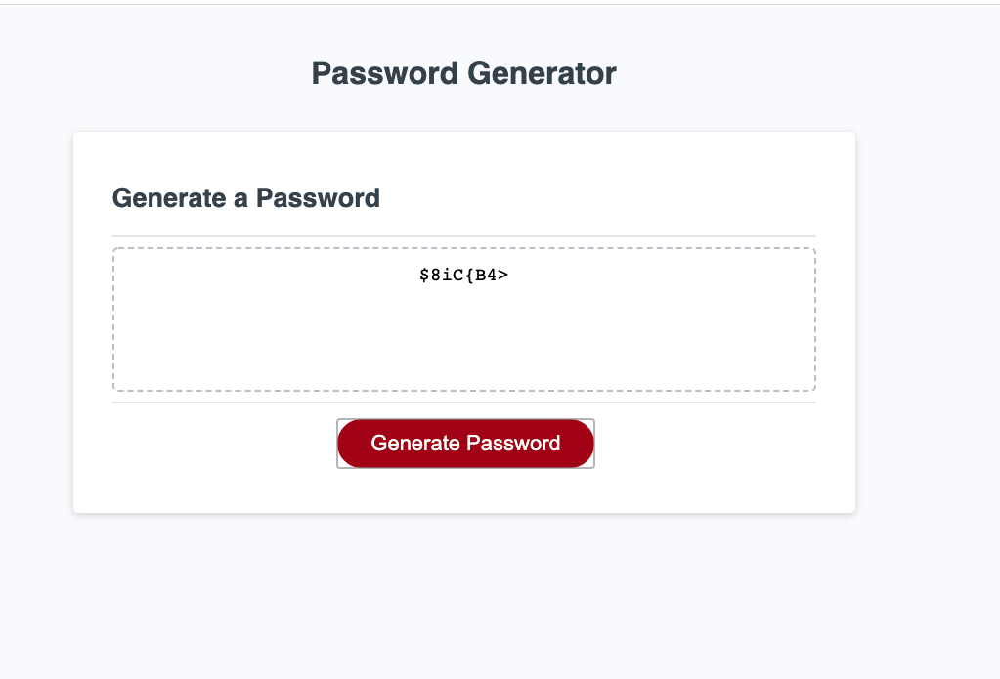

# 03 JavaScript: Password Generator

## Functionality
This application uses JavaScript to generate a password based on user selection criteria. Once the password is generated, it will be written to the webpage. 

## User Inputs
The user has the following options

### Password Length 
The user can specify the length of the password. The input must be a number between 8 and 128 inclusive. If the user enters a different value, they will continue to be prompted until they enter a valid value

### Character Sets
The user can sepcify which sets of characters are to be used in the password. These will be input using confirm() dialogs. If a user does not specify any character set, all of the possible sets will be included 

1. Capital Letters: The English characters A-Z 
2. Small Letters: The English characters a-z
3. Numbers: 0-9
4. Special Characters: The characters found in this string: " !"#$%&'()*+,-./:;<=>?@[\\]^_`{|}~"

## Output 
The application will print the generated password to the password area in the application

## Execution 
The application is found at the [following URL](https://rashir01.github.io/passwordGenerator/) 

## Screen Shot
The image below demonstrates a password that is generated using the application
